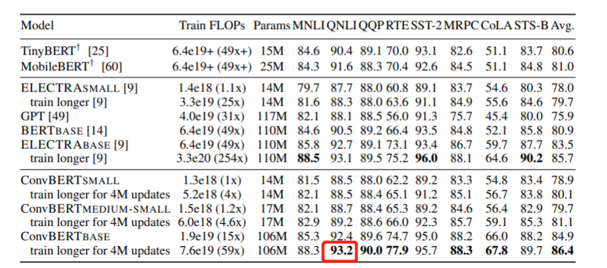

# 使用PaddlePaddle复现论文：ConvBERT: Improving BERT with Span-based Dynamic Convolution

## ConvBERT

[ConvBERT: Improving BERT with Span-based Dynamic Convolution](https://arxiv.org/abs/2008.02496)

**摘要：**
像BERT及其变体这样的预训练语言模型最近在各种自然语言理解任务中取得了令人印象深刻的表现。然而，BERT严重依赖全局自注意力块，因此需要大量内存占用和计算成本。
虽然它的所有注意力头从全局角度查询整个输入序列以生成注意力图，但我们观察到一些头只需要学习局部依赖，这意味着存在计算冗余。
因此，我们提出了一种新颖的基于跨度的动态卷积来代替这些自注意力头，以直接对局部依赖性进行建模。新的卷积头与其余的自注意力头一起形成了一个新的混合注意力块，在全局和局部上下文学习中都更有效。
我们为 BERT 配备了这种混合注意力设计并构建了一个ConvBERT模型。实验表明，ConvBERT 在各种下游任务中明显优于BERT及其变体，具有更低的训练成本和更少的模型参数。
值得注意的是，ConvBERT-base 模型达到86.4GLUE分数，比ELECTRA-base高0.7，同时使用不到1/4的训练成本。

## 原论文效果
<p align="center">
    
</p>
<p align="center">
    
</p>

本项目是 ConvBert 在 Paddle 2.x上的开源实现。

## 快速开始

### 环境安装

```bash
python：     3.8
GPU:         RTX3090
框架：       PaddlePaddle2.1
cuda：       11.2
cudnn：      8.1.1.33-1
```

~~~bash
# 进入paddlenlp目录
cd paddlenlp
# 本地安装
pip install -r requirements.txt
pip install -e .
# 返回初始目录
cd ..
~~~

### 模型精度对齐
运行`python compare.py`，对比huggingface与paddle之间的精度，我们可以发现精度的平均误差在10^-7量级，最大误差在10^-6量级。
```python
python compare.py
# huggingface YituTech/conv-bert-small vs paddle convbert-small
# mean difference: tensor(4.6980e-07)
# max difference: tensor(2.8610e-06)
# huggingface YituTech/conv-bert-medium-small vs paddle convbert-medium-small
# mean difference: tensor(3.4326e-07)
# max difference: tensor(2.8014e-06)
# huggingface YituTech/conv-bert-base vs paddle convbert-base
# mean difference: tensor(4.5306e-07)
# max difference: tensor(8.1062e-06)
```

### **数据准备**

Fine-tuning和预训练使用GLUE数据，这部分Paddle已提供，在执行运行命令时会自动下载。

### **模型预训练**

**特别注意**：预训练模型如果想要达到较好的效果，需要训练几乎全量的Book Corpus数据 和 Wikipedia Corpus数据，原始文本接近20G，建议用GPU进行预训练，最好4片GPU以上。如果资源较少，Paddle提供已经预训练好的模型进行Fine-tuning，可以直接跳转到下面：运行Fine-tuning-使用Paddle提供的预训练模型运行 Fine-tuning。

单机单卡下进行训练：

```shell
export CUDA_VISIBLE_DEVICES="0"
export DATA_DIR=./BookCorpus/

python -u run_pretrain.py \
    --model_type convbert \
    --model_name_or_path convbert-medium-small \
    --input_dir $DATA_DIR \
    --output_dir ./pretrain_model/ \
    --train_batch_size 64 \
    --learning_rate 5e-4 \
    --max_seq_length 128 \
    --weight_decay 1e-2 \
    --adam_epsilon 1e-6 \
    --warmup_steps 10000 \
    --num_train_epochs 4 \
    --logging_steps 100 \
    --save_steps 10000 \
    --max_steps -1 \
    --device gpu
```
其中参数释义如下：
- `model_type` 表示模型类型，默认为ConvBERT模型。
- `model_name_or_path` 如果配置1个名字，则表示预训练模型的规模，当前支持的名字为：convbert-small、convbert-medium-small、convbert-base。如果配置1个路径，则表示按照路径中的模型规模进行训练，这时需配置 --init_from_ckpt 参数一起使用，一般用于断点恢复训练场景。
- `input_dir` 表示输入数据的目录，该目录下需要有1个train.data纯英文文本文件，utf-8编码。
- `output_dir` 表示将要保存预训练模型的目录。
- `train_batch_size` 表示 每次迭代**每张卡**上的样本数目。此例子train_batch_size=64 运行时大致需要单卡12G显存，如果实际GPU显存小于12G或大大多于12G，可适当调小/调大此配置。
- `learning_rate` 表示基础学习率大小，将于learning rate scheduler产生的值相乘作为当前学习率。
- `max_seq_length` 表示最大句子长度，超过该长度将被截断。
- `weight_decay` 表示每次迭代中参数缩小的比例，该值乘以学习率为真正缩小的比例。
- `adam_epsilon` 表示adam优化器中的epsilon值。
- `warmup_steps` 表示学习率逐渐升高到基础学习率（即上面配置的learning_rate）所需要的迭代数，最早的使用可以参考[这篇论文](https://arxiv.org/pdf/1706.02677.pdf)。
- `num_train_epochs` 表示训练轮数。
- `logging_steps` 表示日志打印间隔。
- `save_steps` 表示模型保存间隔。
- `max_steps` 如果配置且大于0，表示预训练最多执行的迭代数量；如果不配置或配置小于0，则根据输入数据量、train_batch_size和num_train_epochs来确定预训练迭代数量
- `device` 表示使用的设备类型。默认为GPU，可以配置为CPU、GPU、XPU。若希望使用GPU训练，将其设置为GPU，同时环境变量CUDA_VISIBLE_DEVICES配置要使用的GPU id。

另外还有一些额外参数不在如上命令中：
- `use_amp` 表示是否开启混合精度(float16)进行训练，默认不开启。如果在命令中加上了--use_amp，则会开启。
- `init_from_ckpt` 表示是否从某个checkpoint继续训练（断点恢复训练），默认不开启。如果在命令中加上了--init_from_ckpt，且 --model_name_or_path 配置的是路径，则会开启从某个checkpoint继续训练。例如下面的命令从第40000步的checkpoint继续训练：

### **Fine-tuning**

#### GLUE
使用Paddle提供的预训练模型运行GLUE数据集的Fine-tuning训练
`可以发现在GLUE排行榜上，与官方的得分相差0.1点。`
<p align="center">
    
</p>


#### QNLI

使用Paddle提供的预训练模型运行QNLI数据集的Fine-tuning训练

```shell
unset CUDA_VISIBLE_DEVICES
# 确保处在qnli文件夹
cd qnli
# 运行训练
python -m paddle.distributed.launch --gpus "0" run_glue.py \
    --model_type convbert \
    --model_name_or_path convbert-base \
    --task_name QNLI \
    --max_seq_length 128 \
    --batch_size 32   \
    --learning_rate 1e-4 \
    --scheduler_type cosine \
    --layer_lr_decay 0.8 \
    --weight_decay 0.01 \
    --warmup_proportion 0.1 \
    --num_train_epochs 3 \
    --logging_steps 10 \
    --save_steps 100 \
    --seed 42 \
    --output_dir QNLI/ \
    --device gpu
```
其中参数释义如下：
- `model_type` 指示了模型类型，当前支持BERT、ELECTRA、ERNIE、CONVBERT模型。
- `model_name_or_path` 模型名称或者路径，其中convbert模型当前仅支持convbert-small、convbert-medium-small、convbert-base几种规格。
- `task_name` 表示 Fine-tuning 的任务，当前支持CoLA、SST-2、MRPC、STS-B、QQP、MNLI、QNLI、RTE。
- `max_seq_length` 表示最大句子长度，超过该长度将被截断。
- `batch_size` 表示每次迭代**每张卡**上的样本数目。
- `learning_rate` 表示基础学习率大小，将于learning rate scheduler产生的值相乘作为当前学习率。
- `scheduler_type` scheduler类型，可选linear和cosine
- `layer_lr_decay` 层学习率衰减，参考原TF代码。
- `num_train_epochs` 表示训练轮数。
- `logging_steps` 表示日志打印间隔。
- `save_steps` 表示模型保存及评估间隔。
- `output_dir` 表示模型保存路径。
- `device` 表示使用的设备类型。默认为GPU，可以配置为CPU、GPU、XPU。若希望使用多GPU训练，将其设置为GPU，同时环境变量CUDA_VISIBLE_DEVICES配置要使用的GPU id。

训练过程中模型会自动对结果进行评估，其中最好的结果如下所示：（详细训练可查看logs文件夹）：

```python
dev acc  : 0.9320885960095185
test acc : 0.933
```
##### 模型链接

链接：https://pan.baidu.com/s/1mtYxl8a7ExK7vENpSrb4Kg 
提取码：f9uy

##### 提交结果至GLUE（其他GLUE任务没有使用ConvBERT跑，只跑了QNLI）

<p align="center">
    
</p>

```bash
# 确保处在qnli文件夹
cd qnli
# 运行预测，请指定模型权重文件夹
python qnli_predict.py \
    --ckpt_path best-qnli_ft_model_6600.pdparams 
   
```
运行完这个命令后，会将结果保存到template/QNLI.tsv之中，想要提交到GLUE的话，将这个template压缩成压缩包，然后提交。


#### SQuAD v1.1

使用Paddle提供的预训练模型运行SQuAD v1.1数据集的Fine-tuning

```shell
unset CUDA_VISIBLE_DEVICES
# 确保处在squad1.1文件夹
cd squad1.1
# 开始训练
python -m paddle.distributed.launch --gpus "0" run_squad.py \
    --model_type convbert \
    --model_name_or_path convbert-base \
    --max_seq_length 512 \
    --batch_size 16 \
    --learning_rate 1e-4 \
    --num_train_epochs 2 \
    --scheduler_type linear \
    --layer_lr_decay 0.8 \
    --logging_steps 500 \
    --save_steps 500 \
    --warmup_proportion 0.1 \
    --weight_decay 0.01 \
    --output_dir squad/ \
    --device gpu \
    --do_train \
    --seed 42 \
    --do_predict
```

训练过程中模型会自动对结果进行评估，其中最好的结果如下所示：（详细训练可查看logs文件夹）

```python
# gloabl step = 9500
{
  "exact": 84.46546830652791,
  "f1": 90.9998989286406,
  "total": 10570,
  "HasAns_exact": 84.46546830652791,
  "HasAns_f1": 90.9998989286406,
  "HasAns_total": 10570
}
```

##### 模型链接

链接：https://pan.baidu.com/s/1TJnc976TM694TEs9HgF66w 
提取码：bt5m

#### SQuAD v2.0

对于 SQuAD v2.0,按如下方式启动 Fine-tuning:

~~~shell
unset CUDA_VISIBLE_DEVICES
# 确保处在squad2.0文件夹
cd squad2.0
# 开始训练
python -m paddle.distributed.launch --gpus "0" run_squad.py \
    --model_type convbert \
    --model_name_or_path convbert-base \
    --max_seq_length 512 \
    --batch_size 16 \
    --learning_rate 1e-4 \
    --num_train_epochs 2 \
    --scheduler_type linear \
    --layer_lr_decay 0.8 \
    --logging_steps 500 \
    --save_steps 500 \
    --warmup_proportion 0.1 \
    --weight_decay 0.01 \
    --output_dir squad/ \
    --device gpu \
    --do_train \
    --do_predict \
    --seed 42 \
    --version_2_with_negative
~~~

* `version_2_with_negative`: 使用squad2.0数据集和评价指标的标志。

训练过程中模型会自动对结果进行评估，其中最好的结果如下所示：（详细训练可查看logs文件夹）

~~~python
# global step = 14000
{
  "exact": 80.94837025183189,
  "f1": 83.96743280565248,
  "total": 11873,
  "HasAns_exact": 74.67948717948718,
  "HasAns_f1": 80.72627019256272,
  "HasAns_total": 5928,
  "NoAns_exact": 87.19932716568545,
  "NoAns_f1": 87.19932716568545,
  "NoAns_total": 5945,
  "best_exact": 80.98206013644403,
  "best_exact_thresh": -0.5712471008300781,
  "best_f1": 83.96743280565195,
  "best_f1_thresh": -0.0010485649108886719
}
~~~

##### 模型链接

链接：https://pan.baidu.com/s/14HW5m2za1Cqtw4gAFXo7nw 
提取码：2bcm


# Reference

```bibtex
@article{Jiang2020ConvBERT,
  title={ConvBERT: Improving BERT with Span-based Dynamic Convolution},
  author={Zi-Hang Jiang and Weihao Yu and Daquan Zhou and Y. Chen and Jiashi Feng and S. Yan},
  journal={ArXiv},
  year={2020},
  volume={abs/2008.02496}
}
```
```bibtex
@inproceedings{wolf-etal-2020-transformers,
    title = "Transformers: State-of-the-Art Natural Language Processing",
    author = "Thomas Wolf and Lysandre Debut and Victor Sanh and Julien Chaumond and Clement Delangue and Anthony Moi and Pierric Cistac and Tim Rault and Rémi Louf and Morgan Funtowicz and Joe Davison and Sam Shleifer and Patrick von Platen and Clara Ma and Yacine Jernite and Julien Plu and Canwen Xu and Teven Le Scao and Sylvain Gugger and Mariama Drame and Quentin Lhoest and Alexander M. Rush",
    booktitle = "Proceedings of the 2020 Conference on Empirical Methods in Natural Language Processing: System Demonstrations",
    month = oct,
    year = "2020",
    address = "Online",
    publisher = "Association for Computational Linguistics",
    url = "https://www.aclweb.org/anthology/2020.emnlp-demos.6",
    pages = "38--45"
}
```